<h1 align="center">
<p>TensorflowASR</p>
<p align="center">


</p>
</h1>
<h2 align="center">
<p>基于Conformer的Tensorflow 2版本的端到端语音识别模型，并且CPU的RTF(实时率)在0.1左右</p>
</h2>
<p align="center">
当前branch为V2版本，为CTC+translate结构
</p>

<p align="center">
欢迎使用并反馈bug
</p>
<p align="center">

旧版请看 [V1版本](https://github.com/Z-yq/TensorflowASR/tree/master)

</p>


## 实现功能

- VAD+降噪
- 在线流式识别/离线识别
- 标点恢复
- TTS数据增强
- 音色转换数据增强
- 远近场数据增强

## 其它项目

TTS：https://github.com/Z-yq/TensorflowTTS

NLU:  -

BOT:  -

## TTS数据增强系统

step1： 准备一个待合成的文本列表,假如命名为text.list, egs：

```text
这是第一句话
这是第二句话
...
```

step2: 下载model

链接：https://pan.baidu.com/s/1deN1PmJ4olkRKw8ceQrUNA 
提取码：c0tp

两个都要下载，然后放到目录 ./augmentations/tts_for_asr/models 下面

step3： 然后在根目录下运行脚本：
```python
python ./augmentations/tts_for_asr/tts_augment.py -f text.list -o save_dir --voice_num 10 --vc_num 3
```
其中：

-f 是step1准备的列表

-o 用于保存合成的语料路径，建议是绝对路径。

--voice_num 每句话用多少个音色合成

--vc_num  每句话使用音色转换增强多少次

运行完毕后，会在 -o 下生成wavs目录和utterance.txt

## Mel Layer

参照librosa库，用TF2实现了语音频谱特征提取的层。

或者可以使用更小参数量的[Leaf](https://github.com/google-research/leaf-audio) 。

使用:
- am_data.yml 
   ```
   mel_layer_type: Melspectrogram #Spectrogram/leaf
   trainable_kernel: True #support train model,not recommend
   ```

## Cpp Inference

已经更新基于ONNX的CPP项目，

详见 [CppInference ONNX](Inference/CppInference/onnx)

## Python Inference

基于ONNX的python inference方案，详情见[python inference](Inference/PythonInference)

# Streaming Conformer

现在支持流式的Conformer结构啦，同epoch训练下，和全局conformer的CER仅差0.8%。



## Pretrained Model

所有结果测试于 _`AISHELL TEST`_ 数据集.

**RTF**(实时率) 测试于**CPU**单核解码任务。 


**AM:**

Model Name|Mel layer(USE/TRAIN)| link                                          |code|train data        |phoneme CER(%)|Params Size|RTF
----------|--------------------|-----------------------------------------------|----|------------------|:---------:|:-------:|-----
ConformerCTC(S)|True/False|pan.baidu.com/s/1k6miY1yNgLrT0cB-xsqqag|8s53|aishell-1(50 epochs)| 6.4|10M|0.056
StreamingConformerCTC|True/False|pan.baidu.com/s/1Rc0x7LOiExaAC0GNhURkHw|zwh9|aishell-1(50 epochs)| 7.2 |15M|0.08


**VAD:**

Model Name| link |code|train data|params size|RTF|
---------|------|----|-------|------|----------|
8k_online_vad|pan.baidu.com/s/1ag9VwTxIqW4C2AgF-6nIgg|ofc9|openslr开源数据|80K|0.0001|


**Punc:**

Model Name| link |code|train data|acc|params size|RTF|
---------|------|----|-------|------|----------|-----|
PuncModel|pan.baidu.com/s/1gtvRKYIE2cAbfiqBn9bhaw|515t|NLP开源数据|95%|600K|0.0001|

**使用：**

test_asr.py 中将model转成onnx文件放入pythonInference中


## Community
欢迎加入，讨论和分享问题。 群已满200人需邀请进入，请添加备注通过。


## What's New?

最新更新

- :1st_place_medal: [2021.08.19]更改了Streaming Conformer结构，舍弃了之前的LSTM结构以提升训练速度，目前已经验证推举配置的训练结果只和全局的conformer相差1%左右。

  

## Supported Structure
-  **CTC**+**Streaming**


## Supported Models

-   **Conformer** 
-   **StreamingConformer**


## Requirements

-   Python 3.6+
-   Tensorflow 2.5+: `pip install tensorflow-gpu 可以参考 https://www.bilibili.com/read/cv14876435 `
-   librosa
-   pypinyin `if you need use the default phoneme`
-   keras-bert
-   addons `For LAS structure,pip install tensorflow-addons`
-   tqdm
-   tf2onnx
-   rir_generator `pip install rir-generator`
-   onnxruntime `pip install onnxruntime or pip install onnxruntime-gpu`

## Usage

1. 准备train_list和test_list.

    **asr_train_list** 格式，其中'\t'为tap，建议用程序写入一个文本文件中，路径+'\t'+文本 
    ```python
    wav_path="xxx/xx/xx/xxx.wav"
    wav_label="这是个例子"
    with open('train.list','w',encoding='utf-8') as f:
      f.write(wav_path+'\t'+wav_label+'\n') :
    ```
    

    例如得到的train.list：
    ```text
    /opt/data/test.wav	这个是一个例子
    ......
    ```
   
    
以下为vad和标点恢复的训练数据准备格式（非必需）：
    
   **vad_train_list** 格式:
   
   ```text
   wav_path1
   wav_path2
   ……
   ```
   例如：
   ```text   
/opt/data/test.wav
```

vad训练内部处理逻辑是靠能量做训练样本，所以确保你准备的训练语料是安静条件下录制的。

   
   
   
   **punc_train_list**格式：
   
   ```text
    text1
    text2
    ……
   ```
   同LM的格式，每行的text包含标点，目前标点只支持每个字后跟一个标点，连续的标点视为无效。
   
   比如：
   ```text
   这是：一个例子哦。 √(正确格式）
   
   这是：“一个例子哦”。 ×(错误格式）
   
   这是：一个例子哦“。 ×(错误格式）

```
  
   
2. 下载bert的预训练模型，用于标点恢复模型的辅助训练，如果你不需要标点恢复可以跳过:
            
   
        https://pan.baidu.com/s/1_HDAhfGZfNhXS-cYoLQucA extraction code: 4hsa
    
3. 修改配置文件 **_`am_data.yml`_** (./asr/configs)来设置一些训练的选项，以及修改**model yaml**（如：./asr/configs/conformer.yml） 里的`name`参数来选择模型结构。

4. 然后执行命令:
  
     ```shell
    python train_asr.py --data_config ./asr/configs/am_data.yml --model_config ./asr/configs/ConformerS.yml
    ```
  
5. 想要测试时，可以参考 **_`./test_asr.py`_** 里写的demo,当然你可以修改 **_`stt`_** 方法来适应你的需求:
   ```python
    python ./test_asr.py  
   ```
也可以使用**Tester** 来大批量测试数据验证你的模型性能:


执行:
```shell
python eval_am.py --data_config ./asr/configs/am_data.yml --model_config ./asr/configs/ConformerS.yml
```
该脚本将展示 **SER/CER/DEL/INS/SUB**  几项指标


6.训练VAD或者标点恢复模型，请参照以上步骤。


## Tips
如果你想用你自己的音素，需要对应 `am_dataloader.py` 里的转换方法。

```python
def init_text_to_vocab(self):#keep the name
    
    def text_to_vocab_func(txt):
        return your_convert_function

    self.text_to_vocab = text_to_vocab_func #here self.text_to_vocab is a function,not a call
```

不要忘记你的音素列表用 **_`<S>`_** 和 **_`</S>`_** 打头,e.g:

        <S>
        </S>
        de
        shì
        ……


## References

参考了以下优秀项目：


https://github.com/usimarit/TiramisuASR 

https://github.com/noahchalifour/warp-transducer

https://github.com/PaddlePaddle/DeepSpeech

https://github.com/baidu-research/warp-ctc

## Licence

允许并感谢您使用本项目进行学术研究、商业产品生产等，但禁止将本项目作为商品进行交易。

Overall, Almost models here are licensed under the Apache 2.0 for all countries in the world.

Allow and thank you for using this project for academic research, commercial product production, allowing unrestricted commercial and non-commercial use alike. 

However, it is prohibited to trade this project as a commodity.
